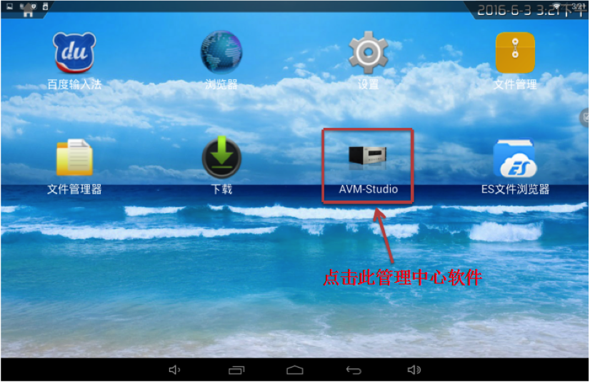

# AVM studio 10.1寸屏内操作使用说明 

#### 概述 
>AVM studio是能支持用户自定义界面，联合con900进行控制的一款软件。我司建议该软件在10.1寸和华为M2-A01w上运行。

#### 操作说明

1、进入管理中心操作

 

2、打开10.1寸触摸屏，进入主界面 
     
 

3、点击应用图标，进入软件应用界面
    
 

4、点击管理中心软件后，进入扫码界面，扫描图中二维码发送到我司研发部售后QQ：2846930295，获取序列号进行认证

 

5、获得序列号并认证后，进入到视频控制界面，点击导航栏内图标，可进入音频控制界面或自定义控制界面，也可左翻进入音频控制界面。

 

6、以下为音频控制界面，继续左翻进入自定义控制界面。

 

7、以下为自定义控制界面，自定义界面可根据用户需求进行添加或删减。
自定义界面可根据用户需求进行添加或删减

 

8、在视频控制界面内，我们可以通过一个输入通道同时控制多个输出通道，同时可根据需求，实时切换不同输入通道，或对已选中输出通道进行撤销，下图中灰色图标为已选中通道。

 

9、在音频控制界面内，我们可以控制每个输入音频的音量大小，也可以对音频直接进行静音。
也可以对音频直接进行静音

 

10、若用户需对控制界面进行编辑，可如下图长按导航栏内设置键左侧位置约2秒，方可进入编辑界面，可对界面内任意的图标进行编辑。

 

11、下图为编辑界面，可在导航栏内选择不同的控制界面进行编辑。

 

12、 点击需修改的图标，弹出操作栏，选择“编辑”，弹出“控件属性”对话框

 

13、下图为“控件属性”对话框，可对所选择的按钮或标签进行命名或调节大小；点击“抬起”选择按钮的背景颜色或标志，修改完成后点击右上角的箭头进行返回并保存已修改内容。

 

14、 若需在自定义界面内增加控制设备按钮，可在左侧选择栏内选择“按钮”“标签”或“图片”直接拖至界面内进行增加。编辑完成后点击右上角的箭头进行返回并保存已修改内容。

 

